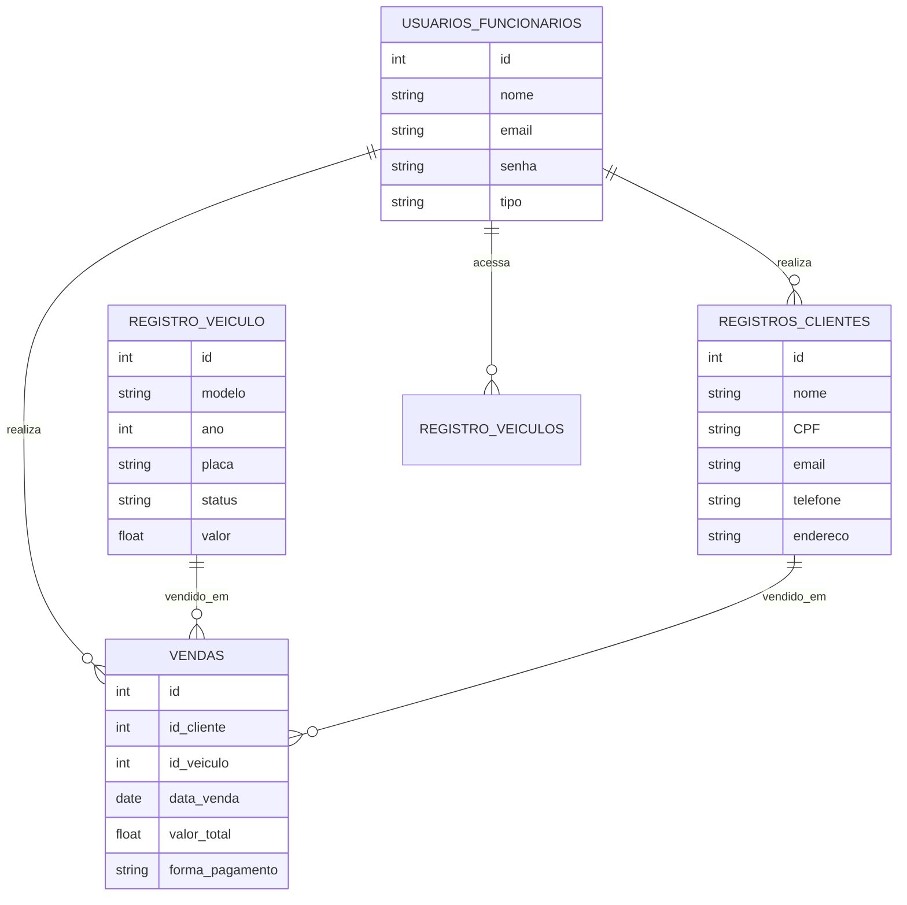

# Discovery do Projeto – Sistema de Gerenciamento de Vendas de Veículos

## Nome do projeto
Sistema de Gerenciamento de Vendas de Veículos

## Time
- Isabele Mororó  
- Mário Serafim

## Visão geral
O projeto tem como objetivo desenvolver uma aplicação fullstack voltada para o gerenciamento de **estoque, vendas e clientes de veículos novos e seminovos** em uma concessionária.

O sistema centralizará todas as operações de venda em um ambiente digital, tornando mais fácil o controle do estoque, o acompanhamento de clientes e vendas, além de permitir a tomada de decisões estratégicas de forma rápida e eficiente.

### Com ele será possível:
- Cadastrar e gerenciar veículos disponíveis para venda (novos e seminovos).  
- Controlar a disponibilidade de veículos em estoque.  
- Cadastrar e acompanhar clientes (PF e PJ).  
- Registrar vendas de veículos associadas a clientes.  
- Emitir relatórios de vendas, estoque e desempenho da equipe de vendas.

## Problema a ser resolvido
Concessionárias de pequeno e médio porte enfrentam dificuldades em organizar seus processos de **venda de veículos** de forma centralizada, resultando em:
- Falhas no controle do estoque de veículos.  
- Perda ou duplicidade de informações de clientes.  
- Demora no acompanhamento de vendas e financiamento.  
- Dificuldade em gerar relatórios precisos de desempenho da equipe.

## Público-alvo
- Concessionárias de veículos novos e seminovos.  
- Vendedores de automóveis.  
- Gestores de vendas e estoque de concessionárias.

## Funcionalidades Mínimas do MVP

### Usuário (Vendedor/Admin):
- Cadastro/Login com diferentes níveis de acesso.  
- Cadastro e edição de veículos disponíveis para venda.  
- Controle de disponibilidade e estoque de veículos.  
- Registro e acompanhamento de clientes (PF e PJ).  
- Registro de vendas de veículos.  
- Relatórios básicos de vendas e estoque.

### Admin (Gestor):
- CRUD completo de veículos (novos e seminovos).  
- CRUD de clientes.  
- CRUD de vendedores/usuários do sistema.  
- Relatórios detalhados de vendas, estoque e desempenho da equipe de vendas.

## Stack de Tecnologias
| Camada | Tecnologia |  
|--------|------------|  
| Backend | Node.js + Express |  
| Frontend | React.js + Vite + Bootstrap |  
| Banco | MySQL |  
| ORM | Prisma ORM |  
| Documentação | Markdown e Swagger |  
| Gerenciamento | GitHub Projects |    

## Entregáveis
| Entregável | Status |  
|------------|--------|  
| Discovery do Projeto | ✅ |  
| Gerenciamento das Tarefas | 🔲 |  
| Protótipo de telas (opcional) | 🔲 |  
| Implementação Frontend | 🔲 |  
| API em Node.js | 🔲 |  
| Documentação dos Endpoints | 🔲 |  
| Desenho do Banco de Dados | 🔲 |  
| Testes automatizados dos endpoints | 🔲 |  
| Testes unitários (50%) | 🔲 |  
| Repositório público no GitHub | ✅ |  
| Apresentação final | 🔲 |

